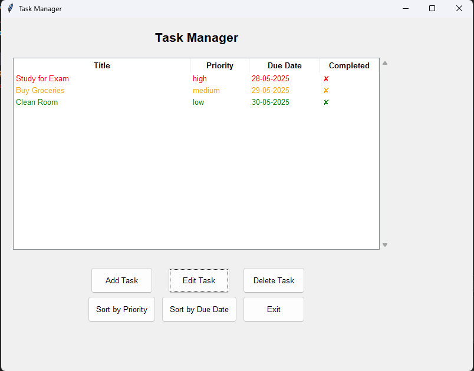
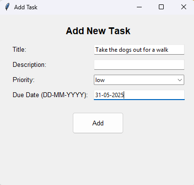
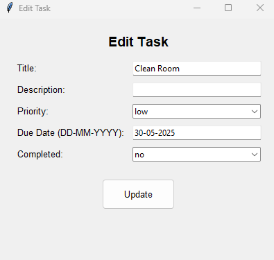
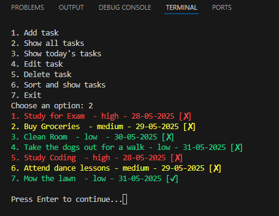

# Task Manager

A simple task management application built with Python. Features both a console interface and a graphical user interface (GUI) using Tkinter.

## Features
- Add, edit, and delete tasks.
- Sort tasks by priority or due date.
- Mark tasks as completed.
- Visual alerts for tasks due soon.
- Persistent storage using JSON.

## How to Run
1. Clone the repository: https://github.com/raulbanos/TaskManager.git
cd TaskManager
2. Run the application: pyhton main.py
3. Choose between the console or GUI interface.

## Requirements
- Python 3.x
- Tkinter (included with Python)

## Screenshots

### Graphical Interface

### Adding a Task

### Editing a Task

### Console Interface

## Project Structure
- `main.py`: Entry point for the application.
- `gui.py`: Graphical user interface using Tkinter.
- `taskOperations.py`: Functions for adding, editing, and deleting tasks.
- `fileOperations.py`: Functions for loading and saving tasks to JSON.
- `displayUtils.py`: Utilities for displaying and sorting tasks.